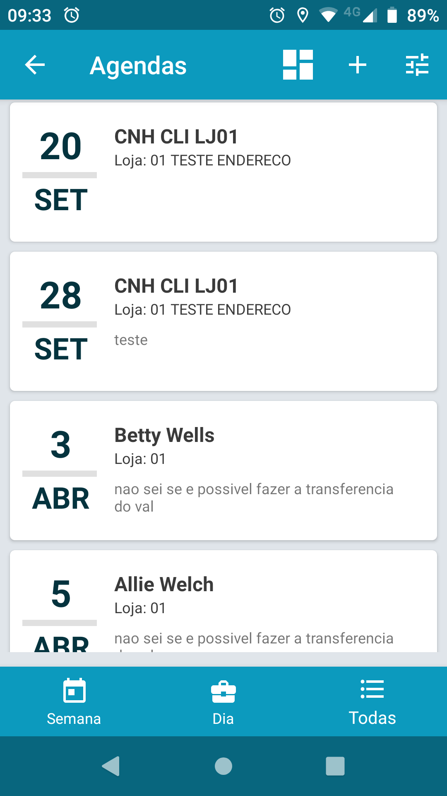
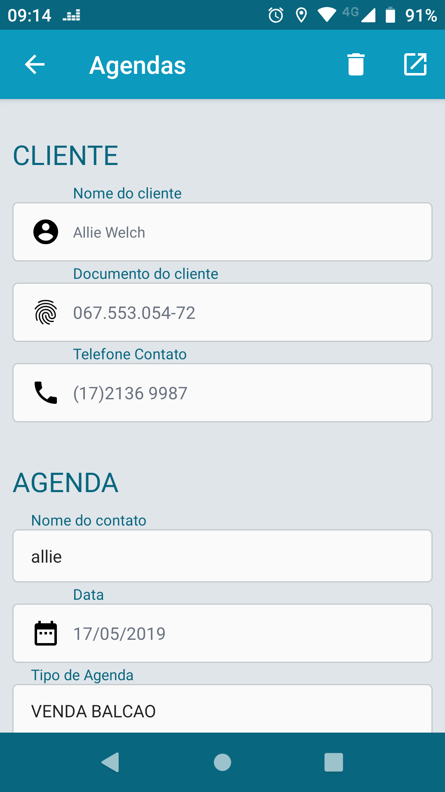

## CEV Mobile

Bem vindo, este guia vai te ajudar a entender e trabalhar com o aplicativo [Cev Mobile](https://play.google.com/store/apps/details?id=itmil.mil_mobile)

O Cev Mobile é um aplicativo criado para que o CRM de DMS da TOTVS possa ser utilizado com maior facilidade e menos dificuldade pelos colaboradores diretamente associados com o atendimento ao cliente. Como ele funciona offline também é possível sua utilização fora de ambiente com conexão o que resolve o problema em caso de fazendas ou áreas afastadas onde não existe rede celular.

Para sua utilização basta que o usuário tenha em mãos o endereço do webservice de integração com protheus e o entendimento geral de sua utilização

### Início

Ao abrir o aplicativo você vai se deparar com a tela principal, nela abra o menu para fazer a configuração inicial, no menu procure `Configurações` nela você deverá colocar o endereço do webservice, porta e seu CPF e clique em salvar, caso não saiba o endereço ou porta do webservice entre em contato com o responsável de TI.

Agora vá para o menu novamente, clique em `Sincronizar`, nela clique no botão `Sincronizar` e você deverá ver que uma nova linha será adicionada acima dos botões e um percentual será apresentado. Caso este comportamento não aconteça possívelmente sua configuração está errada.

Caso algum erro aconteça você pode verificar clicando na linha do percentual, alguns erros de timeout podem acontecer e são até normais dependendo da sua conexão com a internet, caso ocorram você pode sempre tentar novamente fazer a sincronização.

### Agendas

A `Agenda` é a entidade que representa um contato com o cliente, nela você deve registrar todos os contatos, as conversas e os detalhes referentes a negociações, quanto mais detalhes melhor para o negócio.

Para registrar uma agenda entra no `Menu` depois `Agendas`, nele você verá o dashboard.

Nesta tela você pode separar as agendas em agendas da `Semana`, Do `Dia` ou `Todas`, acima pode ser feito um filtro ver as agendas por semana ou no `+` onde podemos criar uma nova agenda.

Ao clicar no `+` você verá a seguinte janela:

